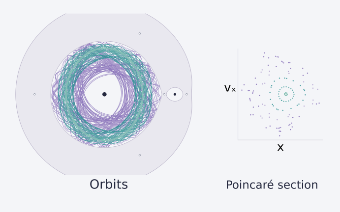

# Celestial dynamics



An accessible Python exploration of the planar circular restricted three-body problem: rotating-frame trajectories, the five Lagrange points, zero-velocity boundaries and Poincaré sections.

## Quick start

Python 3.10 or newer:

```bash
git clone https://github.com/EngFlavioMartins/celestial-dynamics.git
cd celestial-dynamics
python -m venv .venv
source .venv/bin/activate
python -m pip install -e .
celestial-dynamics
```

On Windows, activate with `.venv\Scripts\activate`. No external data or notebook is required.

Open `outputs/demo/dynamics.png` for trajectories, phase-space crossings and Jacobi-conservation diagnostics. SVG versions, each orbit's arrays, and `diagnostics.json` are saved alongside it.

## Examples

A short run:

```bash
celestial-dynamics --duration 20 --x 0.42 0.48 --output outputs/short
```

A more populated section:

```bash
celestial-dynamics --duration 400 --output outputs/long
```

Change the mass fraction and Jacobi constant:

```bash
celestial-dynamics --mu 0.001 --jacobi 3.1 --x 0.4 0.5 --output outputs/small-secondary
```

The CLI starts each trajectory at y = 0, vx = 0 and computes positive vy from the requested Jacobi constant. Forbidden starting points are rejected.

For arbitrary initial conditions:

```python
from celestial_dynamics import integrate, jacobi

orbit = integrate([0.42, 0.0, 0.0, 1.25], duration=20)
print(orbit.max_jacobi_drift)
print(orbit.section_states)  # x, y, vx, vy at upward y=0 crossings
```

## Model and scope

The two point-mass primaries orbit circularly and the test particle has negligible mass. Coordinates are barycentric and rotating; separation, total mass, gravitational constant and angular speed are normalised to one.

This is a **new educational implementation** accompanying the celestial-mechanics review, not its original code, a full N-body model or a mission-design tool. The default mass fraction is Earth–Moon-like; no ephemeris is used.

See [method notes](docs/method.md) for equations, units and event conventions.

## Repository guide

| Location | Purpose |
| --- | --- |
| `src/celestial_dynamics/core.py` | Equations, equilibria, integration and events |
| `src/celestial_dynamics/plotting.py` | Orbits, sections, invariants and vector header |
| `src/celestial_dynamics/cli.py` | Parameterised examples and data export |
| `tests/` | Equilibrium, convergence, conservation and event checks |
| `docs/assets/` | Generated example figures |

## Validation

```bash
python -m pip install -e ".[dev]"
python -m pytest -q
```

Tests check all five equilibria at several mass ratios, L4 stationarity, Jacobi conservation, integration convergence, upward-crossing events and close-approach termination. Each example reports its own numerical errors.

## Reference and licence

[Martins & Zanotello, Celestial mechanics and dynamical systems: a review of the circular restricted three-body problem](https://doi.org/10.1590/1806-9126-rbef-2017-0174).

New code and generated artwork use the [MIT licence](LICENSE). The paper retains its own licence. See [CONTRIBUTING.md](CONTRIBUTING.md).

Plotting uses bundled IBM Plex Sans fonts under their separate [SIL Open Font Licence](src/celestial_dynamics/fonts/OFL.txt). No system font installation is required.
